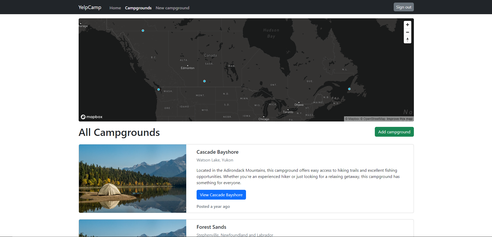
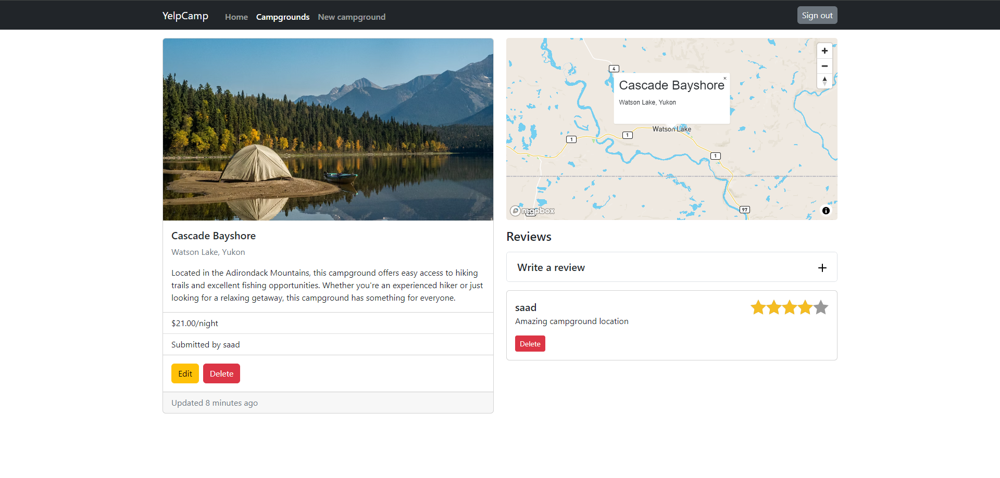

# YelpCamp

Full-stack application, where users can share and review campground locations built with the [MERN stack](https://www.mongodb.com/mern-stack).


<details>

<summary>More Screenshots</summary>





</details>

## Technologies Used

**Frontend:** [React.js](https://reactjs.org/), [React Router](https://reactrouter.com/), [React Query](https://react-query.tanstack.com/), [React-Bootstrap](https://react-bootstrap.github.io/), [Mapbox](https://www.mapbox.com/), [Vite](https://vitejs.dev/)

**[Backend](https://github.com/tariqs26/yelpcamp-server):** [Node.js](https://nodejs.org/), [Express.js](http://expressjs.com/), [Mongoose](https://mongoosejs.com/), [Passport](http://passportjs.org/), [MongoDB](https://mongodb.com/), [Swagger](https://swagger.io/)

## Setup

**1. Clone the repo**

```bash
git clone https://github.com/tariqs26/yelpcamp-client.git
cd yelpcamp-client
```

**2. Install dependencies**

```bash
npm i
```

**3. Configure environment variables**

Create a `.env` file in the root directory and add the following environment variables:

```bash
VITE_API_URL=      # Backend API URL
VITE_MAPBOX_TOKEN= # Mapbox API token
```

**4. Start the development server**

```bash
npm run dev
```

Open <http://localhost:3001> to view the app in the browser.

## Available Scripts

| Script            | Description                                                   |
| ----------------- | ------------------------------------------------------------- |
| `npm run build`   | Build the app for production                                  |
| `npm run preview` | Preview the production build                                  |
| `npm run dev`     | Run the app in the development mode (<http://localhost:3001>) |
| `npm run format`  | Format using Prettier                                         |
| `npm run lint`    | Lint using Biome                                              |
