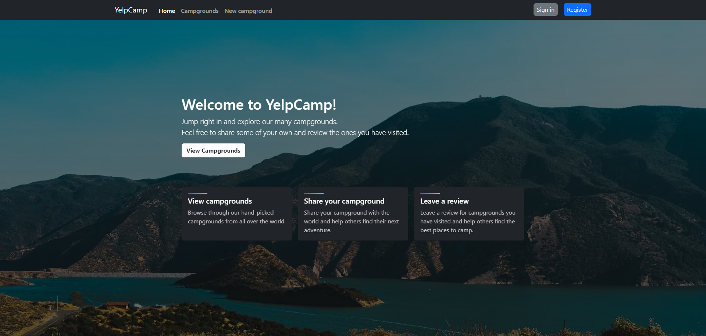

# YelpCamp

A full stack web application, where users can create, edit, delete and view and review campgrounds locations built with the MERN stack.

## Notable Features

- Speedy initial page load times with React Suspense and Lazy loading components.
- React Router for routing, with protected routes for authenticated users, and NavLinks which prevent the page from reloading, and maintain the active state.
- Performant and Robust data fetching with React Query, with the ability to cache data and refetch it when needed.
- Great user experience with Flash messages for feedback, using a custom Context, form validation feedback and skeleton loading components using Bootstrap.
- RESTful API built with Express, with CRUD operations for campgrounds, reviews and users.
- User authentication and authorization with Passport, managing user sessions with Express Sessions and storing user data in MongoDB, along with setting up a front-end Context API to manage the global state.

## Features to be implemented

- Pagination for the campgrounds index page, using React Query to fetch the data.
- Search functionality for the campgrounds index page, using React Query to fetch the data.

## Tech Stack

A high level overview of the tech stack used in this project.

### Frontend

- [React](https://reactjs.org/) with [TypeScript](https://www.typescriptlang.org/) as the primary frontend framework.
- [React Router](https://reactrouter.com/) for routing.
- [React Query](https://react-query.tanstack.com/) for data fetching and caching, and for managing the global state.
- [Bootstrap](https://getbootstrap.com/) used to create a standardized, aesthetic and responsive UI.
- [Vite](https://vitejs.dev/) for the frontend build tool.

### [Backend](https://github.com/tariqs26/yelpcamp-server)

- [Node.js](https://nodejs.org/en/) with [TypeScript](https://www.typescriptlang.org/) as the primary backend framework.
- [Express](https://expressjs.com/) for creating the RESTful API, managing middleware and routing.
- [MongoDB](https://www.mongodb.com/) database used for storing all campgrounds, reviews and users data.
- [Mongoose](https://mongoosejs.com/) for modeling the data, and for interacting with the MongoDB database.
- [Joi](https://joi.dev/) used for validating the data sent to the backend.
- [Passport](http://www.passportjs.org/) for managing user authentication and authorization.
- [Express Sessions](https://www.npmjs.com/package/express-session) for managing user sessions.

## Installation

- `npm install` - install all the dependencies

## Available Scripts

- `npm run dev` - runs the app in the development mode
- `npm run build` - builds the app for production to the `dist` folder
- `npm run serve` - serves the app in production mode

## Environment Variables

- `VITE_API_URL` - the URL of the backend API
- `VITE_MAPBOX_TOKEN` - the Mapbox API token
